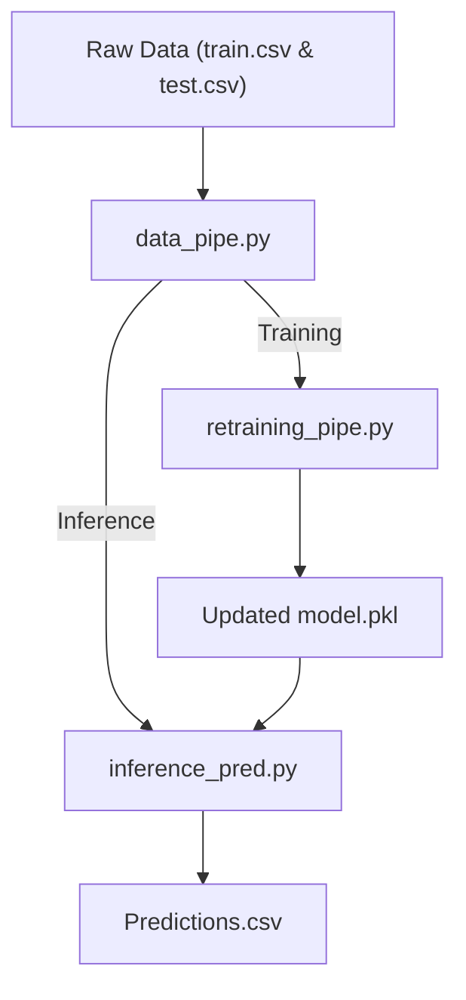

# 🚕 NYC Taxi Fare Prediction 🗽

## 📝 Description  
A Kaggle competition focused on predicting taxi fare amounts in New York City using real-world ride data. The dataset includes pickup/dropoff locations, timestamps, and passenger counts. The goal is to build a machine learning model that minimizes RMSE between predicted and actual fares.


This project involves data preprocessing, feature engineering, and model evaluation to create accurate, real-world predictive solutions.
➡️ Learn more: [Competition Link on Kaggle](https://www.kaggle.com/competitions/new-york-city-taxi-fare-prediction/overview)

---

## ⏳ Dataset
- **Source**: [Kaggle](https://www.kaggle.com/competitions/new-york-city-taxi-fare-prediction/data)
- **Competition Host**: Google Cloud
- **File descriptions**:  
  - train.csv - Input features and target `fare_amount` values for the training set (about 55M rows).
  - test.csv - Input features for the test set (~10K rows). The goal is to predict `fare_amount` for each row. 
  - sample_submission.csv – Example submission file in the correct format (`key`, `fare_amount`). This file predicts a constant fare of **$11.35**, the mean from the training set.
- 🧾 **Data fields** (8 Columns):
  - *ID*:
    - `key` - Unique string identifying each row in both the training and test sets. Comprised of pickup_datetime plus a unique integer, but this doesn't matter, it should just be used as a unique ID field.
Required in your submission CSV. Not necessarily needed in the training set, but could be useful to simulate a 'submission file' while doing cross-validation within the training set.
  - *Features*:
    - `pickup_datetime` - timestamp value indicating when the taxi ride started.
    - `pickup_longitude` - float for longitude coordinate of where the taxi ride started.
    - `pickup_latitude` - float for latitude coordinate of where the taxi ride started.
    - `dropoff_longitude` - float for longitude coordinate of where the taxi ride ended.
    - `dropoff_latitude` - float for latitude coordinate of where the taxi ride ended.
    - `passenger_count` - integer indicating the number of passengers in the taxi ride.
  - *Target*:
    - `fare_amount` - float dollar amount of the cost of the taxi ride. This value is only in the training set; this is what you are predicting in the test set and it is required in your submission CSV.

> ⚠️ **Note:** The repository does **not** include the `train.csv` file because it is **5.3 GB** in size, exceeding GitHub’s **100 MB per file** size limit.

---

## 🧹 Data Cleansing
1. Dropped missing values (NA/null) — **376/55,423,856 ≈ 0.00068%**.
2. Dropped unused columns like `key`.
3. Converted `pickup_datetime` to pandas datetime (UTC → New York local time).
4. Filtered out outliers where:
   - `fare_amount`:
     - Can't be negative.
     - Very high fares (e.g. > $500) are unrealistic for a yellow cab trip in NYC (typical max is <$200, even JFK → far suburbs).
   - Coordinates (`pickup_longitude`, `pickup_latitude`, `dropoff_longitude` & `dropoff_latitude`):
     - NYC sits around longitude ~ -74, latitude ~ 40.7.
     - So anything far outside [-75, -72] and [40, 42] is not NYC.
   - `passenger_count`:
     - A yellow cab can officially hold up to 6 passengers.
     - 0 or negative passengers is invalid.

➡️ **Result:** All of the applied steps above have reduced the dataset from **55,423,856** to **54,067,135** rows.

---

## ⚙️ Feature Engineering
- Extracted time-based features from `pickup_datetime_nyc`:  
   - `year` — Year of the trip.
   - `month` — Month of the trip.
   - `day_of_month` — Day number within the month.
   - `day_of_week` — Day of the week (Monday=0, Sunday=6).
   - `hour` — Hour of the day when the ride started.

- Added custom flags to capture important temporal patterns:  
   - `is_weekend` — 1 if the ride occurred on Saturday or Sunday, else 0.
   - `is_rush_hour` — 1 if the ride happened during morning (7–9) or evening (16–19) rush hours, else 0.
   - `is_holiday` — 1 if the date corresponds to a fixed-date U.S. federal holiday (New Year’s Day, Independence Day, Veterans Day, or Christmas Day), else 0.

- Dropped original datetime columns (`pickup_datetime`, `pickup_datetime_nyc`) after extracting relevant features to avoid redundancy.

- Calculated trip distance using the Haversine formula, which measures the great-circle distance between pickup and dropoff coordinates on Earth’s surface (in kilometers).
   - Function `haversine_np()` converts longitude/latitude values from degrees to radians and computes the distance using Earth’s radius (~6367 km).
   - The result is stored in a new column: `distance_km`.

- Filtered unrealistic distances to ensure data quality:
   - Removed trips shorter than **0.5 km** (likely GPS noise or very short rides).
   - Removed trips longer than **100 km** (outside realistic NYC taxi range).

- Added pickup distances to NYC airports using the Haversine formula:  
   - Calculated the distance between each pickup location and major airports:  
     - JFK Airport (`jfk_pickup_dist`)  
     - LaGuardia Airport (`lga_pickup_dist`)  
     - Newark Airport (`ewr_pickup_dist`)  

- Added dropoff distances to key NYC landmarks to capture proximity-based fare patterns:  
   - Calculated the distance between each dropoff location and well-known tourist destinations:  
     - Times Square (`times_sq_dropoff_dist`)
     - Central Park (`central_park_dropoff_dist`)
     - World Trade Center (`wtc_dropoff_dist`)
     - Metropolitan Museum of Art (`met_dropoff_dist`)
     - Midtown Manhattan (`midtown_dropoff_dist`)

➡️ **Result:** After feature engineering and filtering, the dataset size reduced from **54,067,135** to **51,814,907** rows, while the number of columns increased from **8** to **23** — significantly enriching model input quality.

---

## :mag: Explotary Data Analysis (EDA)
🔹 Histogram of Fare Amount:

 


🔹 Bar Plot of Passenger Counts:

 

 
🔹 Line Plot of Fare Amount over Time:


 
🔹 Correlation Matrix showing that there is a strong positive correlation between `distance_km` and target column `fare_amount`:


 
🔹 Others include Histogram of each of the other columns and Box Plot of each column for outliers check.

---

## ⏱️ Time-Saving Techniques
- From nearly **52 million rows** of cleaned data, a **2 million–row representative sample** (with identical `fare_amount` distribution) was created to **significantly reduce execution time** during model experimentation.  
- Leveraged **GPU-accelerated training** in XGBoost using:  
  ```python
  xgbr_model = XGBRegressor(tree_method="gpu_hist", device="cuda")

---

## 🤖 Machine Learning
- Testes 3 regression models: `Decision Tree`, `Random Forest` & `XGBoost`.
- Looking at the model evaluation results 👇

| Model           | Train_MSE ↓ | Train_MAE ↓ | Train_R² ↑ | Test_MSE ↓ | Test_MAE ↓ | Test_R² ↑ |
|-----------------|--------------|--------------|-------------|-------------|-------------|------------|
| Decision Tree   | 20.340171    | 2.221170     | 0.775733    | 19.230010   | 2.181637    | 0.785311   |
| Random Forest   | 9.786742     | 1.543428     | 0.891085    | 9.484220    | 1.518077    | 0.894115   |
| XGBRegressor    | 9.467511     | 1.511427     | 0.894864    | 9.449993    | 1.503741    | 0.894498   |

### 🔎 Analysis

- **Decision Tree** → Slight overfitting (Train_R² ≈ 0.78, Test_R² ≈ 0.79). Performs decently but lacks generalization.
- **Random Forest** → Strong and consistent results across both training and testing sets, indicating good bias-variance balance.
- **XGBRegressor** → ✅ Achieved the best overall performance, showing the lowest Train/Test errors and highest R² values. It generalizes well while maintaining efficiency through gradient boosting optimization.

📌 **Conclusion**: XGBoost Regressor delivered the best predictive accuracy and generalization, making it the final selected model for fare amount prediction.

- ⚙️ Best Parameters (via Grid Search CV):
{'objective': 'reg:squarederror',
 'base_score': None,
 'booster': None,
 'callbacks': None,
 'colsample_bylevel': None,
 'colsample_bynode': None,
 'colsample_bytree': None,
 'device': 'cuda',
 'early_stopping_rounds': None,
 'enable_categorical': False,
 'eval_metric': None,
 'feature_types': None,
 'gamma': None,
 'grow_policy': None,
 'importance_type': None,
 'interaction_constraints': None,
 'learning_rate': 0.1,
 'max_bin': None,
 'max_cat_threshold': None,
 'max_cat_to_onehot': None,
 'max_delta_step': None,
 'max_depth': 9,
 'max_leaves': None,
 'min_child_weight': 1,
 'missing': nan,
 'monotone_constraints': None,
 'multi_strategy': None,
 'n_estimators': 300,
 'n_jobs': None,
 'num_parallel_tree': None,
 'random_state': 42,
 'reg_alpha': 0.01,
 'reg_lambda': 1,
 'sampling_method': None,
 'scale_pos_weight': None,
 'subsample': 1.0,
 'tree_method': 'gpu_hist',
 'validate_parameters': None,
 'verbosity': None}

- 🧠 Final Model Evaluation:

| Metric  | Training | Testing |
| ------- | -------- | ------- |
| **MSE** | 8.9586   | 8.7578  |
| **MAE** | 1.4157   | 1.4035  |
| **R²**  | 0.9005   | 0.9022  |

✅ The model demonstrates **excellent generalization**, achieving a mean absolute error (MAE) of just **$1.4** between predicted and actual fare amounts.

---

## 📊 Feature Importance
The chart below displays the ranked contribution of each feature to predicting `fare_amount`, with `distance_km` being the most influential.


---

## ⚙️ Pipelines
The project is modularized into **three main pipelines**, ensuring reproducibility, scalability, and clear separation of concerns between data preprocessing, model retraining, and inference.  

| Pipeline | Description | Key Operations |
|-----------|--------------|----------------|
| **`data_pipe.py`** | Handles **data preprocessing** for both training and inference. | - Cleans missing/outlier values.<br>- Extracts **temporal**, **holiday**, and **distance** features.<br>- Converts datetimes to **New York local time**.<br>- Returns preprocessed DataFrame ready for training or prediction. |
| **`retraining_pipe.py`** | Automates **model retraining** with new data. | - Runs `preprocess_data_retrain()` to clean & enrich raw data.<br>- Loads previously saved model and metadata (`ref_column`, `target`).<br>- Retrains on new + existing data.<br>- Saves the updated model version to `models/`. |
| **`inference_pred.py`** | Performs **real-time predictions** on unseen test data. | - Calls `preprocess_data_predict()`.<br>- Ensures feature alignment with training columns.<br>- Loads the trained model and predicts `fare_amount`.<br>- Saves final predictions (`key`, `fare_amount`) to `data/processed/predictions.csv`. |

### 🔄 Pipeline Flow Overview


---

## 📂 Repository Structure  
```bash
project_structure/
│
├── data/
│   ├── raw/            # Original immutable datasets
│   ├── interim/        # Intermediate steps (various data cleaning methods)
│   └── processed/      # Final datasets (clean/test/predictions)
│
├── figures/            # Box Plot, Histograms, Correlation Matrix and Feature Importance
│
├── models/
│   ├── modelling       # Training scripts
│   └── model           # Serialized trained models
│
├── pipelines/
│   ├── data_pipe       # Data preprocessing pipeline (for retraining and predicting)
│   ├── inference_pred  # Inference (prediction) pipeline
│   └── retraining_pipe # Retraining pipeline
│
├── libraries           # Common imports
└── README.md


